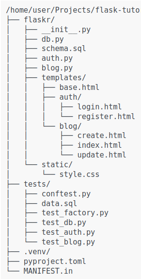

## This is Flask tutorial with simple blog application

**Flask application can be as simple as a single page**


A Flask application is an instance of the Flask class. Everything about the application such as configurations and URLs will be registered with this class.


Project Structure


 <br>


The most straigtforward way to create a Flask application is to create a global Flask instance directly at the top of your code.


Instead of creating a Flask instance globally, you will create it inside a function. This function is known as the application factory. Any configuration, registration, and other setup the application needs will happen inside the function, then the application will be returned.

```bash
import os
from flask import Flask

def create_app(test_config=None): 

    # create and configure the app

    app = Flask(__name__, instance_relative_config=True)
    app.config.from_mapping(
        SECRET_KEY='dev',
        DATABASE=os.path.join(app.instance_path, 'flaskr.sqlite'),
    )

    if test_config is None:
        # load the instance config if it exists when not testing
        app.config.from_pyfile('config.py', silent=True)
    else:
        # load the test config if passed in
        app.config.from_mapping(test_config)

    # ensure the instance folder exists

    try:
        os.makedirs(app.instance_path)
    except OSError:
        pass

    @app.route('/')
    def hello():
        return "<h1>Hello World</h1>"
    
    return app

```


`create_app` is the application factort function

- `app = Flask(__name__, instance_relative_config=True)`
    - `__name__` is the name of the current module
    - `instance_relatice_config=True`

- `app.config.from_mapping()`